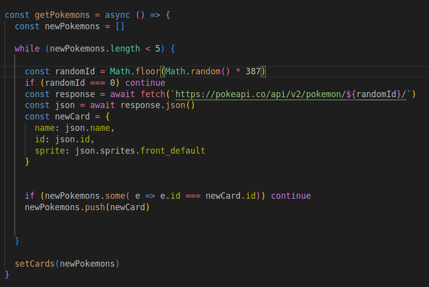

# Memory Game

A memory game created using React and Javascript, for The Odin Project Curriculum.

## Features

This memory game consists of several images displayed on the screen.
The player must click one of the image, after the click the images displayed will change, the game consists in not clicking the same image twice.
If the player manage to not click the same image for 5 rounds, the player win. Otherwise the player loses and the game restart.

## Technical aspects

### Fetching for images

<!--  -->

        const getPokemons = async () => {
            const newPokemons = []

            while (newPokemons.length < 5) {
            
            const randomId = Math.floor(Math.random() * 387)
            if (randomId === 0) continue
            const response = await fetch(`https://pokeapi.co/api/v2/pokemon/${randomId}/`)
            const json = await response.json()
            const newCard = {
                name: json.name,
                id: json.id,
                sprite: json.sprites.front_default
            }
        

            if (newPokemons.some( e => e.id === newCard.id)) continue
            newPokemons.push(newCard)

            }

            setCards(newPokemons)
        }

For the game, a number of pokemons will be display, fetched from [PokeApi](https://pokeapi.co/api/v2/) with the plain pokemon species followed by `randomId`.

The json object provided is parsed to extract the name, id, and an image's url of the front view of the pokemon to an object.

The pokemon object is pushed to an array called `newPokemons`.

This happens a fixed number of times, in the developing process it will happen five times. When `newPokemons` contains five pokemons objects it is passed to `setCards`, updating the states and the images shown for the game.

The process includes some points of control.

- The `randomId` have a maximum of 387, i.e. only first to third generation pokemon will be displayed.
- If `randomId == 0`the loop will start over, as there is no id: 0 in PokeApi.
- To prevent repeated pokemons in the array the `some()`method is called.

